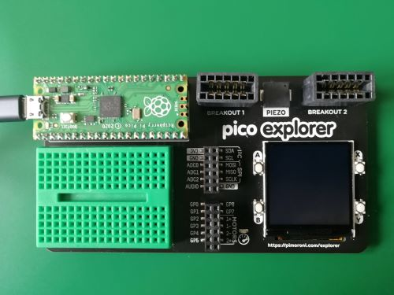

# pico-explorer
This repository contains examples written in MicroPython to use on the Pimoroni Pico Explorer Base.

Instructions on setting up MicroPython on the Pico can be found here:

[Pimoroni Pico setting up MicroPython](https://github.com/pimoroni/pimoroni-pico/blob/main/setting-up-micropython.md)  
[Pimoroni tutorial on getting started with the Pico](https://learn.pimoroni.com/tutorial/hel/getting-started-with-pico)