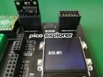
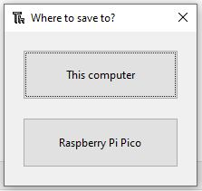

# BMP280 breakout examples
Examples using the BMP280 breakout module inserted into the "Breakout 1" slot of the Pico Explorer.

   

The following examples use a BMP280 MicroPython library that is copied to the Pico.  
[BMP280 MicroPython library](https://github.com/dafvid/micropython-bmp280)

One way to copy the library onto the Pico is to open the file in Thonny, and then Save as and then select "Raspberry Pi Pico"  

- [temperature-simple.py](temperature-simple.py):  
  Displays the temperature and updates every second.